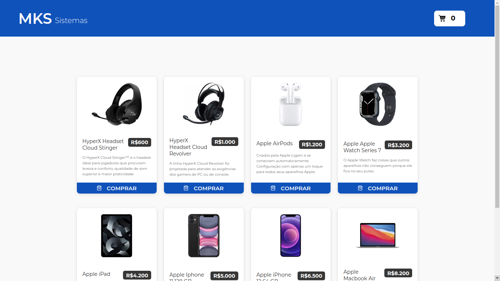
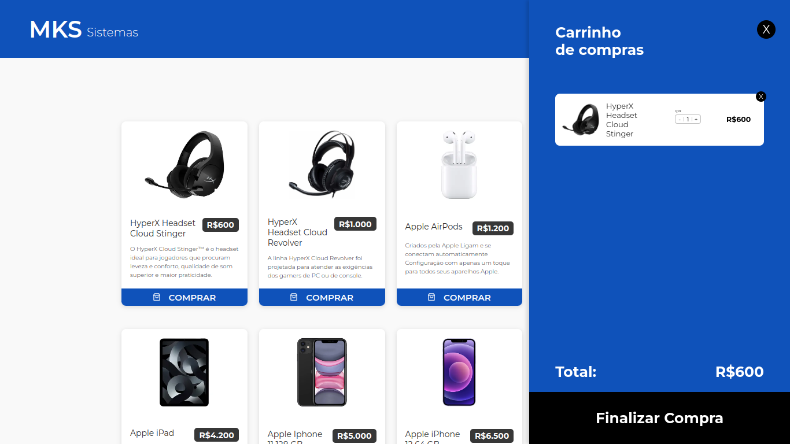

# mks-products

## Sumário

- [mks-products](#mks-products)
  - [Sumário](#sumário)
  - [Motivação](#motivação)
  - [Pilha de tecnologia](#pilha-de-tecnologia)
  - [Galeria](#galeria)

## Motivação

Este app é uma solução eficiente e elegante para facilitar o processo de compras on-line. Composto por duas telas cuidadosamente desenvolvidas, proporciona uma experiência de usuário intuitiva e fluida.

Na primeira tela, os usuários têm acesso a uma lista completa de produtos eletrônicos, exibindo informações cruciais como nome, marca, preço e uma representação visual através de fotos. Essa interface meticulosamente projetada garante que os clientes possam explorar os itens disponíveis de forma rápida e eficaz.

A segunda tela, dedicada ao checkout, oferece funcionalidades avançadas para otimizar a experiência de compra. Aqui, os usuários podem ajustar a quantidade de produtos no carrinho, proporcionando flexibilidade e controle sobre suas escolhas. A soma total do carrinho é exibida de maneira clara e acessível, garantindo transparência no processo de compra.

Ambas as telas são desenvolvidas com responsividade em mente, adaptando-se perfeitamente a diferentes dispositivos e tamanhos de tela. Isso garante uma experiência consistente e agradável, independentemente do dispositivo utilizado. Vale ressaltar que este aplicativo consome uma API pronta, garantindo a integração eficiente de dados atualizados e mantendo a aplicação sempre alinhada com as informações mais recentes disponíveis.

Este projeto foi originalmente desenvolvido como parte de um teste técnico para a vaga de [Desenvolvedor Front-end Junior](https://www.linkedin.com/jobs/view/3751114010/) na [MKS Desenvolvimento de Sistemas](https://mkssistemas.com/pt). O desafio incluía a replicação fiel de um protótipo visual fornecido temporariamente no Figma pelo recrutador. Embora a vaga tenha sido encerrada antes da conclusão da correção de todos os repositórios, a experiência foi valiosa, proporcionando a oportunidade de adquirir conhecimentos específicos, como react-query, sob demanda.

## Pilha de tecnologia

| Papel | Tecnologia |
|-|-|
| Biblioteca de desenvolvimento front-end | [React](https://react.dev/) |
| Gerenciamento de estado assíncrono | [react-query](https://tanstack.com/query/v3/) |
| Biblioteca de estilização | [Styled Components](https://styled-components.com/) |
| Framework de testes unitários e E2E | [Jest](https://jestjs.io/pt-BR/) |
| Hospedagem | [Vercel](https://vercel.com/) |

## Galeria

